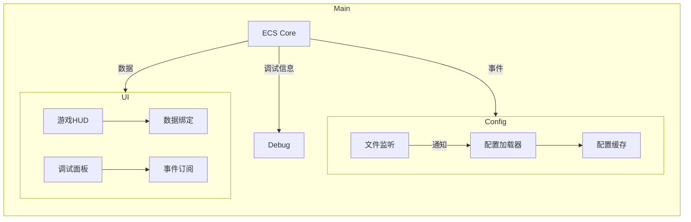
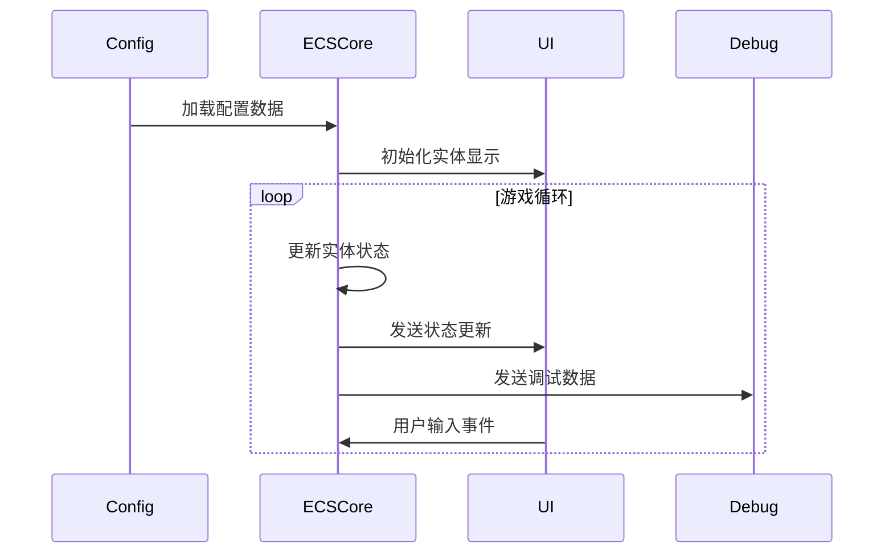
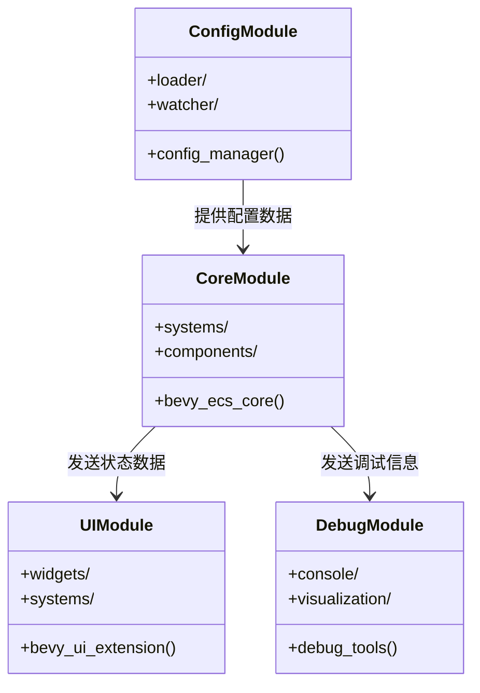
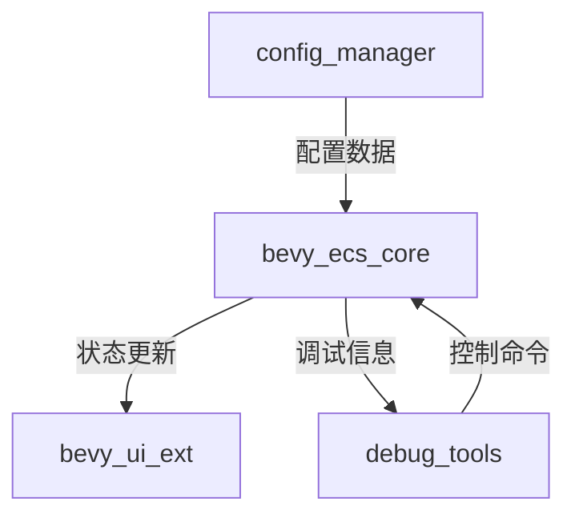
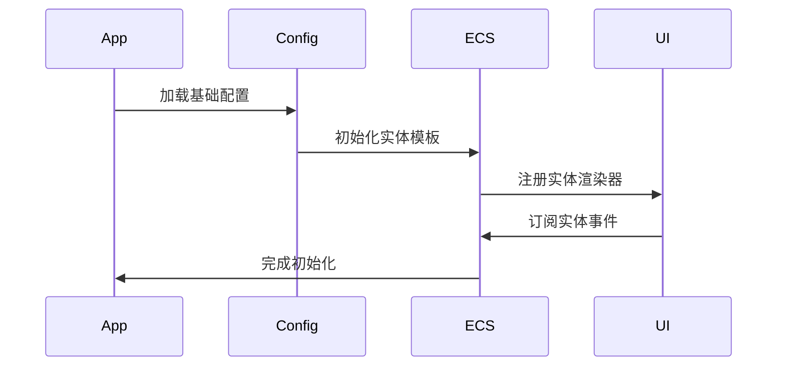
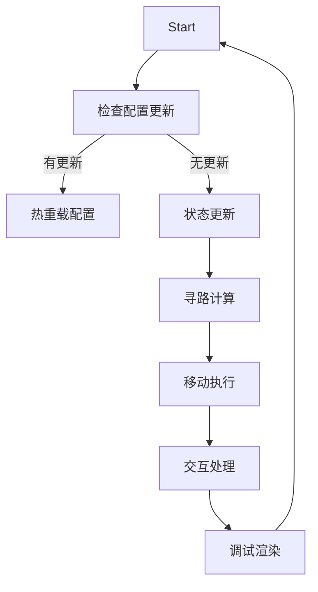
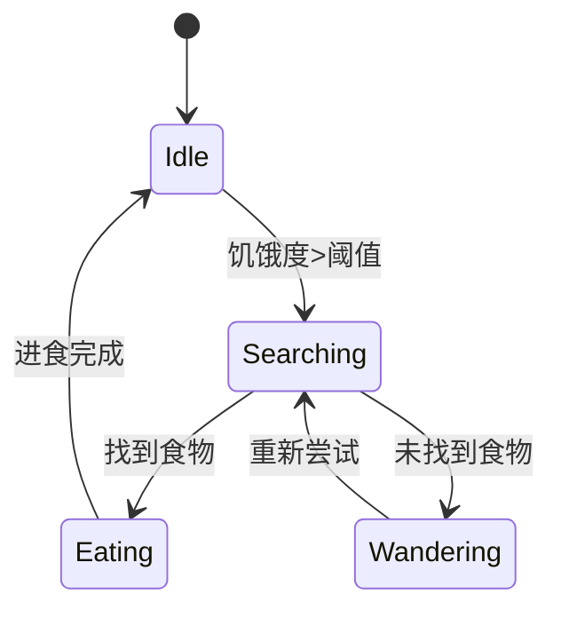

# Bevy 生态系统模拟器系统设计

## 1. 核心架构

### 1.1 模块关系图


### 1.2 典型时序图


### 1.3 数据流图


### 模块职责说明
| 模块 | 职责 |
|------|------|
| ECS Core | 实体组件系统核心管理 |
| UI Module | 所有用户界面实现 |
| Config Module | 配置加载和热更新 |
| Debug Module | 开发调试工具集 |
| Simulation Systems | 核心游戏逻辑系统 |
| Entity Management | 实体生命周期管理 |

## 2. 模块化架构设计

### 2.1 模块划分规范


### 2.2 模块目录结构
| 模块名称       | Rust crate名称     | 主要子模块                 |
|----------------|--------------------|--------------------------|
| 核心模块       | `bevy_ecs_core`    | systems, components      |
| UI模块         | `bevy_ui_ext`      | widgets, layouts         |
| 配置模块       | `config_manager`   | loader, hot_reload       |
| 调试模块       | `debug_tools`      | console, diagnostics     |

### 2.3 模块接口定义

#### 核心模块接口
```rust
// bevy_ecs_core/src/lib.rs
pub mod prelude {
    pub use systems::{SimulationSystems, EntitySystems};
    pub use components::{Position, Hunger, Species};
}

pub trait CoreModuleInterface {
    fn spawn_entity(&mut self, entity_type: Species) -> Entity;
    fn query_entities(&self, query: QueryParams) -> Vec<Entity>;
}
```

#### UI模块接口
```rust
// bevy_ui_ext/src/lib.rs
pub mod widgets {
    pub struct HudPanel;
    pub struct EntityCard;
}

pub trait UIModuleInterface {
    fn create_hud(&mut self) -> Entity;
    fn update_entity_card(&mut self, entity: Entity);
}
```

#### 配置模块接口
```rust
// config_manager/src/lib.rs
pub struct ConfigHandle(Arc<ConfigData>);

pub trait ConfigModuleInterface {
    fn get_config(&self) -> ConfigHandle;
    fn watch_config(&mut self) -> Receiver<ConfigEvent>;
}
```

#### 调试模块接口
```rust
// debug_tools/src/lib.rs
pub enum DebugCommand {
    Spawn,
    Inspect(Entity),
    Pause
}

pub trait DebugModuleInterface {
    fn execute_command(&mut self, cmd: DebugCommand);
    fn attach_console(&mut self);
}
```

### 2.4 模块依赖关系


### 2.5 模块测试策略
| 模块 | 测试重点 | 测试工具 |
|------|---------|---------|
| bevy_ecs_core | 实体生命周期, 系统执行 | bevy_test |
| bevy_ui_ext | 布局计算, 数据绑定 | wasm_bindgen_test |
| config_manager | 热重载, 错误处理 | tokio_test |
| debug_tools | 命令解析, 可视化 | assert_cmd |
```rust
// UI模块接口
pub trait UIManager {
    fn create_hud(&mut self, config: &UIConfig) -> Entity;
    fn update_debug_panel(&mut self, stats: &SimulationStats);
}

// 配置模块接口
pub trait ConfigProvider {
    fn load_entity_config(&self) -> Result<EntityConfig>;
    fn watch_for_changes(&mut self) -> Receiver<ConfigEvent>;
}
```

### 2.2 模块通信机制
```rust
// 使用Bevy事件系统进行跨模块通信
pub enum GameEvent {
    ConfigReloaded,
    EntitySpawned(EntityType, Position),
    HungerChanged(Entity, f32)
}

// 核心模块总线
pub struct ModuleBus {
    pub ui: Box<dyn UIManager>,
    pub config: Box<dyn ConfigProvider>
}
```

### 2.3 错误处理设计
```rust
#[derive(Debug)]
pub enum SimError {
    ConfigLoadError(String),
    SpawnFailed(Position),
    PathfindingTimeout
}

impl Error for SimError {}

// 统一错误处理系统
pub fn error_handler_system(
    mut errors: EventReader<SimError>,
    mut ui: ResMut<ModuleBus>
) {
    for error in errors.read() {
        ui.ui.display_error(error);
    }
}

## 3. ECS 组件设计

### 基础组件
```rust
#[derive(Component)]
pub struct Position {
    pub q: i32, // 六边形轴向坐标Q
    pub r: i32  // 六边形轴向坐标R
}

#[derive(Component)]
pub struct Hunger {
    pub current: f32,
    pub threshold: f32,
    pub consume_rate: f32
}
```

### 实体标记组件
```rust
#[derive(Component)]
pub struct Rabbit;

#[derive(Component)]
pub struct Fox;
```

## 3. 核心系统设计

### 3.1 移动系统
```rust
pub fn movement_system(
    mut query: Query<(&mut Position, &MoveTarget, &MoveSpeed)>,
    time: Res<Time>
) {
    // 实现A*寻路和随机移动逻辑
}
```

### 3.2 状态机系统
```rust
pub fn state_machine_system(
    mut query: Query<(
        &mut Hunger,
        &mut State,
        Option<&Rabbit>,
        Option<&Fox>
    )>
) {
    // 处理饥饿状态转换
}
```

## 4. 数据驱动实现

### 4.1 配置加载
```rust
pub struct EntityConfig {
    pub rabbit: RabbitConfig,
    pub fox: FoxConfig
}

#[derive(Deserialize)]
pub struct RabbitConfig {
    pub hunger_threshold: f32,
    pub move_interval: [f32; 2]
}
```

### 4.2 热重载监听
```rust
pub fn config_watcher_system(
    mut events: EventReader<FileEvent>,
    mut config: ResMut<EntityConfig>
) {
    // 监听配置文件变化
}
```

## 4. UI系统详细设计

### 4.1 UI组件
```rust
#[derive(Component)]
pub struct HudPanel {
    pub population_counts: HashMap<EntityType, u32>,
    pub time_elapsed: f32
}

#[derive(Component)]
pub struct EntityInfoCard {
    pub entity: Entity,
    pub health_bar: Entity
}
```

### 4.2 UI系统
```rust
// HUD更新系统
pub fn update_hud_system(
    mut query: Query<&mut HudPanel>,
    stats: Res<SimulationStats>
) {
    for mut panel in &mut query {
        panel.population_counts = stats.current_population();
        panel.time_elapsed = stats.time_elapsed;
    }
}

// 实体信息卡片系统
pub fn entity_card_system(
    selected: Res<SelectedEntity>,
    mut commands: Commands
) {
    if selected.just_changed() {
        commands.spawn(EntityInfoCard {
            entity: selected.entity,
            health_bar: create_health_bar()
        });
    }
}
```

### 4.3 UI资源
```rust
#[derive(Resource)]
pub struct UiAssets {
    pub font: Handle<Font>,
    pub health_bar: Handle<Image>,
    pub species_icons: HashMap<EntityType, Handle<Image>>
}

#[derive(Resource)]
pub struct UiConfig {
    pub scale_factor: f32,
    pub color_scheme: ColorScheme
}
```

## 5. 调试系统

### 5.1 控制台命令
```rust
pub enum DebugCommand {
    SpawnEntity(EntityType, [i32; 2]),
    SetHunger(Entity, f32),
    SetGameSpeed(f32)
}
```

### 5.2 可视化调试
```rust
pub fn debug_panel_system(
    query: Query<(&Hunger, &Position)>,
    mut ui: ResMut<DebugUi>
) {
    // 渲染实体状态面板
}
```

## 6. 性能优化

### 6.1 空间分区
```rust
pub struct HexGrid {
    partitions: HashMap<(i32, i32), Vec<Entity>>
}
```

### 6.2 批处理
```rust
#[derive(SystemSet, Hash, Debug, PartialEq, Eq, Clone)]
pub struct SimulationSet;
```

## 7. 系统执行流程

### 7.1 初始化流程


### 7.2 主循环流程图


### 7.3 状态转换图
